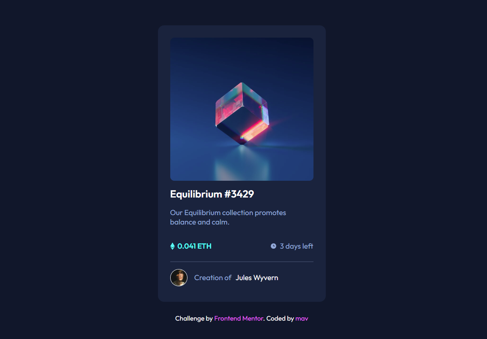

# [Frontend Mentor - NFT preview card component solution](https://stylecard-xmavv.netlify.app/)

This is a solution to the [NFT preview card component challenge on Frontend Mentor](https://www.frontendmentor.io/challenges/nft-preview-card-component-SbdUL_w0U)

## Table of contents

- [Welcome](#welcome)
  - [Screenshot](#screenshot)
  - [Deploying project](#Deploying_project)
- [My process](#my-process)
  - [Built with](#built-with)
  - [What I learned](#what-i-learned)
  - [Useful resources](#useful-resources)

## Welcome 😎

Thanks for checking out this front-end coding challenge

The challenge was to code a nft card

### Screenshot

### Deploying_project

- Here is live server ==> https://stylecard-xmavv.netlify.app/

## My process

### Built with

- Semantic HTML5 markup
- CSS custom properties
- Flexbox

### What I learned

Finally learned how to center items correctly (height: 100vh at the body tag :D)

Tricky one was with the hover animation on main image, I needed to reasearch and give it some time

Images have their's own display: inline-block, and in this case I had to change it to block, in case to cover all image with my cyan bg color

### Useful resources

- [res1](https://www.youtube.com/watch?v=9bGbykdR4T8&t=1603s&ab_channel=TsbSankara) - This helped me with main image hover